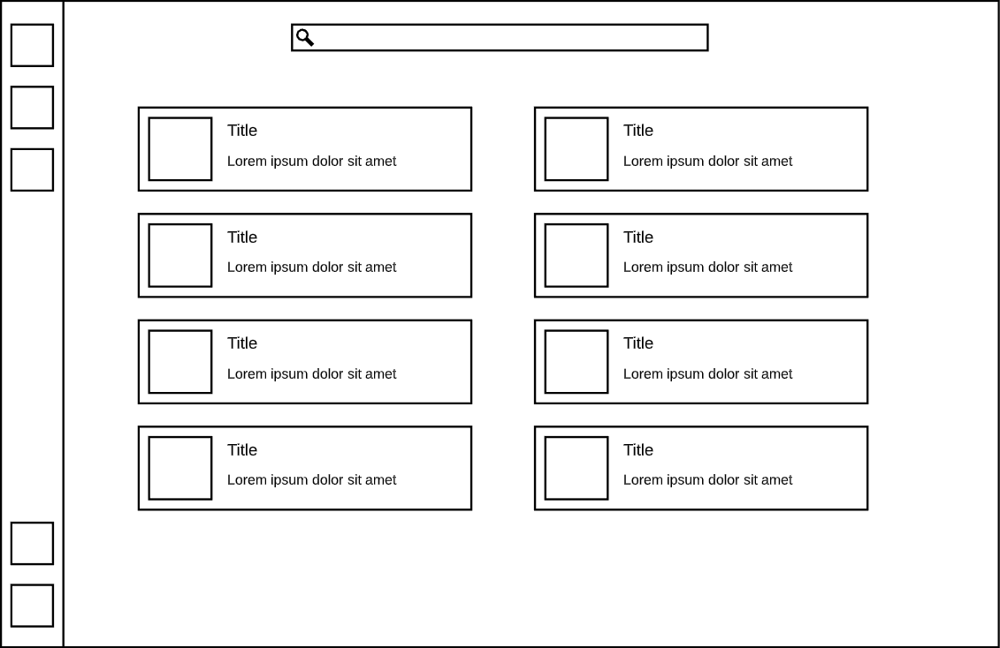
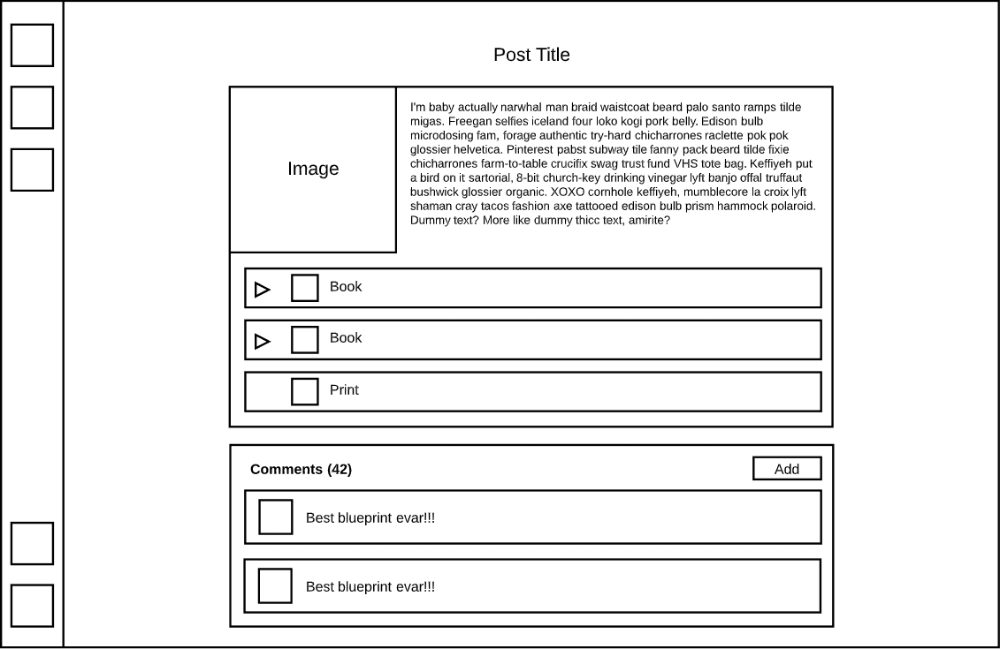
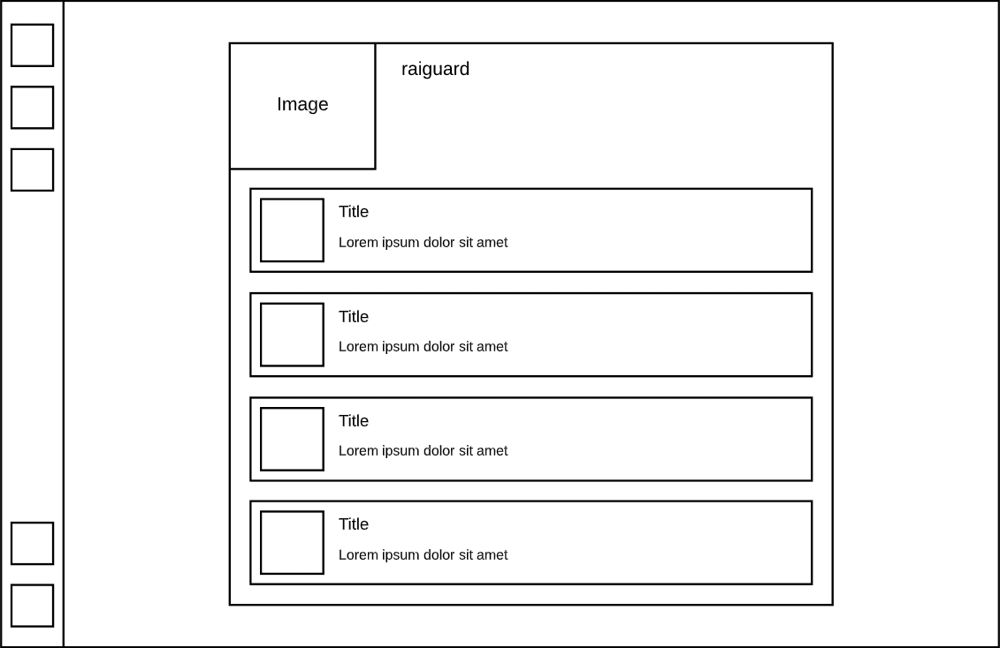
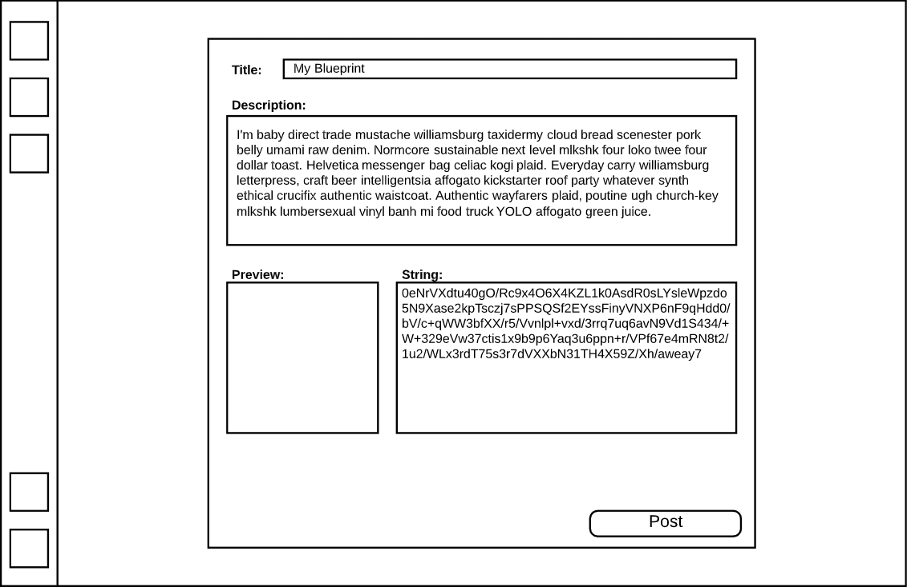
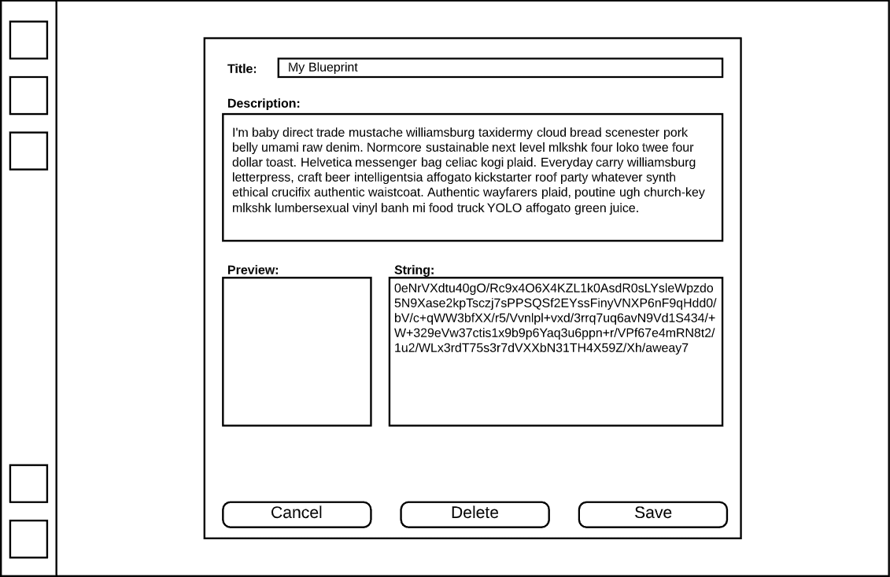

# The Blueprint Library

## Features

### MVP

- Create posts
  - Includes a title, description, image, and one blueprint object (either a book or a print)
- Edit or delete your posts
- Search for and explore uploads
- Comment on posts
- Edit or delete your comments
- Copy blueprint strings to the clipboard
- Like a post and/or save it for later

### Extra

- "Follow" posts to receive notifications on an update
- Use the blueprint renderer to auto-generate screenshots for the blueprints
- Mod support
- Post version history
- Create and manage public and private collections
- Add tags to posts to aid in searches
- Hiererchal comment trees (instead of single-level comments only)

## Views

- Home / Search / Explore
- Post
- Profile
- Create post
- Edit post

### Routes

- Same as views

## Schemas

### users

| column name | datatype    | constraints |
| ----------- | ----------- | ----------- |
| id          | serial      | primary key |
| username    | varchar(30) |             |
| password    | text        |             |
| avatar      | text        |             |
| is_admin    | boolean     |             |

### posts

| column name       | datatype      | constraints          |
| ----------------- | ------------- | -------------------- |
| id                | serial        | primary key          |
| author_id         | int           | references users(id) |
| title             | varchar(80)   |                      |
| img               | text          |                      |
| description       | varchar(3000) |                      |
| created_timestamp | int           |                      |
| edited_timestamp  | int           |                      |

### comments

| column name       | datatype      | constraints          |
| ----------------- | ------------- | -------------------- |
| id                | serial        | primary key          |
| post_id           | int           | references posts(id) |
| author_id         | int           | references users(id) |
| content           | varchar(1000) |                      |
| created_timestamp | int           |                      |
| edited_timestamp  | int           |                      |

### records

| column name       | datatype     | constraints            |
| ----------------- | ------------ | ---------------------- |
| id                | serial       | primary key            |
| type              | varchar(5)   |                        |
| name              | varchar(200) |                        |
| description       | varchar(500) |                        |
| icon_1            | varchar(100) |                        |
| icon_2            | varchar(100) |                        |
| icon_3            | varchar(100) |                        |
| icon_4            | varchar(100) |                        |
| grid_snap_x       | smallint     |                        |
| grid_snap_y       | smallint     |                        |
| absolute_snapping | boolean      |                        |
| active_index      | smallint     |                        |
| post_id           | int          | references posts(id)   |
| book_id           | int          | references records(id) |
| string            | text         |                        |

## Endpoints

```
POST "/auth/register"
  Receive: req.body {
    username: "Example",
    password: "ecksdee420"
  }
  Send: {
    id: 1
    username: "Example",
    avatar: "https://robohash.org/Example"
  }

GET "/auth/me"
  Send: {
    id: 1,
    username: "Example",
    avatar: "https://robohash.org/Example"
  }

POST "/api/post"
  Receive: req.body {
    author_id: 1,
    title: "My Space Science setup",
    img: "https://s3.aws/theimage",
    description: "This is my awesome space science setup."
  }
  Send: status

GET "/api/post/:postid"
  Send: {
    id: 4,
    timestamp: 1595440477,
    author_id: 1,
    title: "My Space Science setup",
    img: "https://s3.aws/theimage",
    description: "This is my awesome space science setup."
  }

PUT "/api/post/:postid"
  Receive: req.body {
    title: "My Space Science setup v2",
    img: "https://s3.aws/theupdatedimage",
    description: "I updated it with a fix to the input belt."
  }
  Send: status

DELETE "/api/post/:postid"
  Send: status

POST "/api/comment"
  Receive: req.body {
    author_id: 1,
    post_id: 4,
    content: "Nice blueprint, bro!"
  }
  Send: status

GET "/api/comments/:postid"
  Send: [
    {
      id: 420,
      author_id: 1,
      content: "Nice blueprint, bro!"
    }
  ]

PUT "/api/comment/:commentid"
  Receive: req.body {
    content: "Even nicer blueprint, bro!"
  }
  Send: status

DELETE "/api/comment/:commentid"
  Send: status

GET "/api/records"
  Receive: req.params {
    postid: 4,
    bookid: 100
  }
  Send: [
    {
      id: 69,
      type: "print",
      name: "Foo",
      description: "Bar",
      string: "0aaaabbbbccccxd"
    }
  ]

GET "/api/record/:recordid"
  Send: {
    id: 69,
    type: "print",
    name: "Foo",
    description: "Bar",
    string: "0aaaabbbbccccxd"
  }
```

## Points

- Fully responsive: 10
- Use redux to store user state: 10 (only using one reducer, for user data)
- Using hooks absolutely everywhere: 10
- Functioning authentication: 10
- Amazon S3: 20
- SASS everywhere: 20 / 10 (max 30 for additional techs)
- Hosted: 10
- Picture-perfect presentation: 10

## Wireframes

### Home / Search



### Post



### Profile



### Create post



### Edit post


